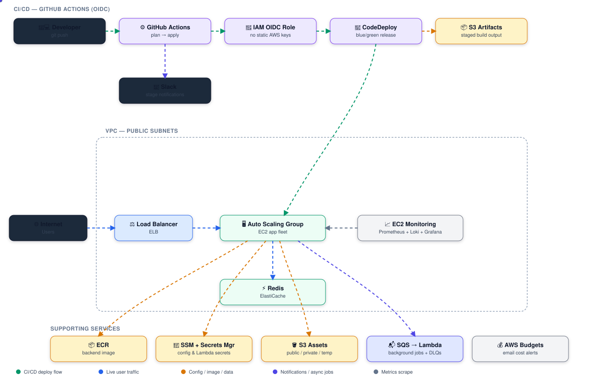

# EC2 Terraform Deployment

A cost-optimized AWS infrastructure for running a containerized backend on plain **EC2 + Auto Scaling + CodeDeploy** (blue/green), with a self-hosted observability stack, background job processing via SQS/Lambda, and federated (keyless) CI/CD from GitHub Actions.

Built from real-world infrastructure I've deployed in my career, generalized here as a reference implementation — client-specific names, account IDs, and domains have been replaced with placeholders. It's the "low-cost" counterpart to an ECS/EKS setup: same deployment discipline (blue/green releases, autoscaling, encrypted state, OIDC auth) without the cost of a managed container orchestrator.

## What it deploys

- **Networking** — VPC with public subnets across multiple AZs
- **Compute** — Auto Scaling Group of EC2 instances behind a Classic/Application Load Balancer, with SSH access restricted to an allow-listed IP
- **Releases** — AWS CodeDeploy performs blue/green deployments onto the ASG, artifacts staged through a dedicated S3 bucket
- **Caching** — single-node Redis (ElastiCache) for sessions/caching
- **Storage** — S3 buckets for public assets, private assets, and short-lived temporary assets (each with independent versioning/CORS/lifecycle rules)
- **Background jobs** — a fleet of purpose-built SQS queues (each with its own DLQ) feeding Lambda consumers, covering things like transaction processing, notifications, and event ingestion
- **Config/secrets** — SSM Parameter Store (KMS-encrypted) for app and Lambda config, plus Secrets Manager for Lambda function secrets
- **CI/CD** — GitHub Actions authenticates to AWS via **OIDC** (no long-lived AWS keys in CI), runs `terraform plan` on every push and `apply` on merge to `main`, with Slack notifications on failure/success at every stage
- **Observability** — a dedicated monitoring EC2 instance running Prometheus + Loki + Grafana, scraping the app fleet over private security-group-scoped ports (Prometheus 9090, node_exporter 9100, Loki 3100)
- **Cost control** — an AWS Budgets alert with email notification thresholds
- **Container registry** — ECR repository for the backend image, referenced by the EC2 user-data script at boot to pull and run the current release

## Architecture



## Repository layout

```
.
├── module/
│   ├── vpc/                        # VPC + public subnets
│   ├── aws_load_balancer_module/   # ELB + security group
│   ├── aws_security_group_module/  # EC2 app security group
│   ├── aws_key_pair_module/        # EC2 SSH key pair
│   ├── auto_scaling_module/        # Launch template + ASG
│   ├── code_deploy_module/         # CodeDeploy app + blue/green deployment group
│   ├── ec2_instance_module/        # Standalone EC2 (used for the monitoring host)
│   ├── ecr_repository/             # Container registry
│   ├── redis/                      # ElastiCache Redis
│   ├── s3/                         # Reusable S3 bucket module (assets, artifacts)
│   ├── sqs/, sqs_event/            # Queues + DLQs, Lambda event source mappings
│   ├── lambda_function/, lambda_layer/  # Background job compute
│   ├── parameter_store/            # SSM parameters (KMS-encrypted)
│   ├── secrets_manager/            # Lambda secrets
│   ├── sns_notifications_module/   # ASG lifecycle notifications
│   ├── budget/                     # AWS Budgets cost alerts
│   ├── github_oidc/                # GitHub Actions OIDC identity provider + role
│   ├── iam_role/, log_group/       # Shared IAM + CloudWatch log group helpers
├── Utils/
│   ├── EC2_user_data.sh            # App instance boot script (pulls image from ECR, blue/green nginx proxy, Fluent Bit shipping)
│   ├── EC2_monitoring_user_data.sh # Monitoring instance boot script (Prometheus/Loki/Grafana)
│   └── modify_tfvars.sh            # CI helper to inject the AWS profile per environment
├── .github/workflows/deploy.yml    # OIDC-authenticated plan/apply pipeline with Slack notifications
├── backend-dev.hcl / backend-test.hcl / backend-prod.hcl   # Per-environment S3 remote state backend config
├── main.tf / variables.tf / outputs.tf / versions.tf
└── deploy.sh                        # Convenience wrapper: init + validate + plan/apply/destroy
```

## Prerequisites

- [Terraform](https://www.terraform.io/downloads.html) >= 1.0
- AWS CLI installed and configured with a profile that has permissions to manage VPC, EC2, ASG, ELB, CodeDeploy, ECR, S3, SQS, Lambda, SSM, Secrets Manager, IAM, and Budgets
- A GitHub OIDC-trusted IAM role if deploying via the included Actions workflow

## Usage

1. **Configure your AWS CLI profile**, then set it per-environment via `Utils/modify_tfvars.sh` (used automatically by the CI pipeline) or by editing `<env>.tfvars` directly (not committed — see `.gitignore`).

2. **Deploy an environment:**
   ```bash
   chmod +x deploy.sh
   ./deploy.sh dev plan     # or apply / destroy
   ./deploy.sh prod plan
   ```
   `deploy.sh` re-initializes Terraform against the correct `backend-<env>.hcl`, runs `terraform validate`, then the requested command against `<env>.tfvars`.

3. **CI/CD**: pushes to `dev`/`main` trigger `.github/workflows/deploy.yml`, which assumes an AWS role via OIDC (no stored AWS credentials in GitHub), runs `plan`, uploads the plan artifact, and — on the `apply` job — applies it, notifying Slack at each failure point.

## Design notes

- **No long-lived AWS credentials in CI** — GitHub Actions authenticates via OIDC federation directly to an IAM role scoped to specific repos (`module/github_oidc`).
- **Blue/green releases**: CodeDeploy shifts traffic between instance sets on the ASG rather than replacing instances in place, so a bad deploy can be rolled back without downtime.
- **Defense in depth for the data/queue tier**: every SQS queue has its own dead-letter queue so poison messages don't block a whole pipeline.
- **Self-hosted observability** avoids per-metric SaaS billing — Grafana/Prometheus/Loki run on a single small EC2 instance, reachable only from the app fleet's security group plus HTTP(S) for the dashboard itself. The demo Grafana admin password in `Utils/EC2_monitoring_user_data.sh` is a placeholder — source it from SSM/Secrets Manager and use a generated value in any real deployment.
- **No secrets in code**: `.gitignore` excludes `*.tfvars`, `*.tfstate`, plan artifacts, and key material; runtime secrets are read from SSM Parameter Store / Secrets Manager.

## License

MIT License. See [LICENSE](LICENSE) for details.
